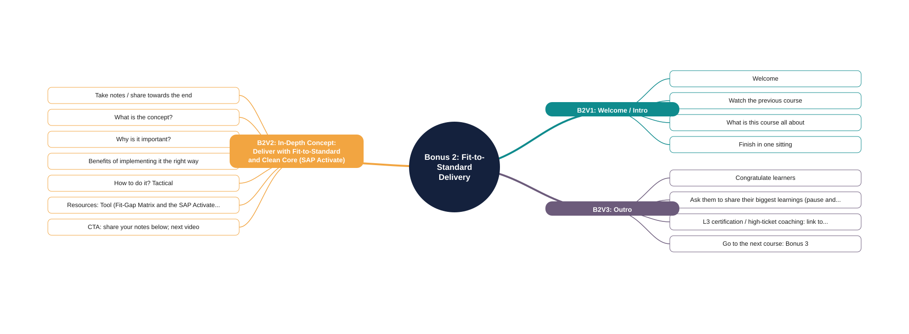
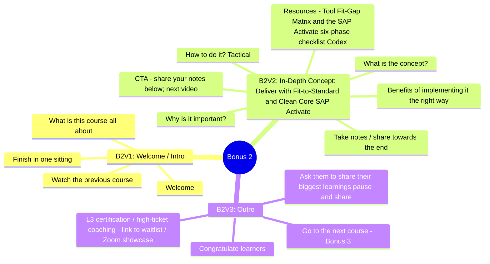

# Bonus 2 Mind Map

```mermaid
mindmap
  root((Bonus 2))
    B2V1: Welcome / Intro
      Welcome
      Watch the previous course
      What is this course all about
      Finish in one sitting
    B2V2: In-Depth Concept: Deliver with Fit-to-Standard and Clean Core SAP Activate
      Take notes / share towards the end
      What is the concept?
      Why is it important?
      Benefits of implementing it the right way
      How to do it? Tactical
      Resources - Tool Fit-Gap Matrix and the SAP Activate six-phase checklist Codex
      CTA - share your notes below; next video
    B2V3: Outro
      Congratulate learners
      Ask them to share their biggest learnings pause and share
      L3 certification / high-ticket coaching - link to waitlist / Zoom showcase
      Go to the next course - Bonus 3
```
