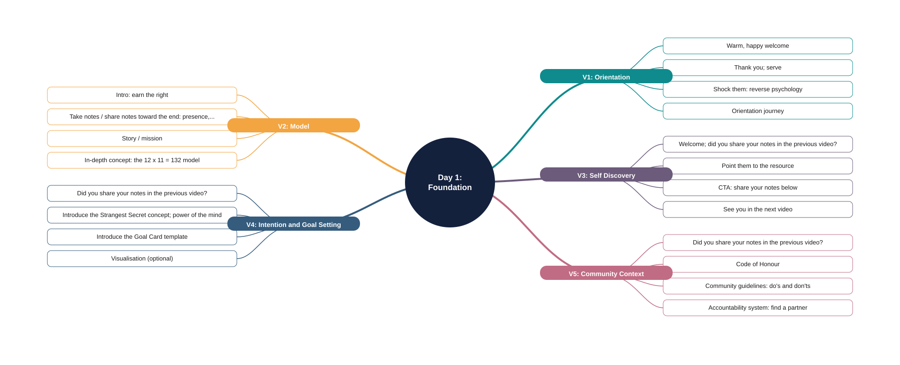
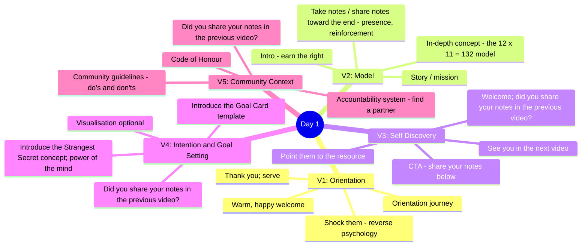

# Day 1 Mind Map

```mermaid
mindmap
  root((Day 1))
    V1: Orientation
      Warm, happy welcome
      Thank you; serve
      Shock them - reverse psychology
      Orientation journey
    V2: Model
      Intro - earn the right
      Take notes / share notes toward the end - presence, reinforcement
      Story / mission
      In-depth concept - the 12 x 11 = 132 model
    V3: Self Discovery
      Welcome; did you share your notes in the previous video?
      Point them to the resource
      CTA - share your notes below
      See you in the next video
    V4: Intention and Goal Setting
      Did you share your notes in the previous video?
      Introduce the Strangest Secret concept; power of the mind
      Introduce the Goal Card template
      Visualisation optional
    V5: Community Context
      Did you share your notes in the previous video?
      Code of Honour
      Community guidelines - do's and don'ts
      Accountability system - find a partner
```
