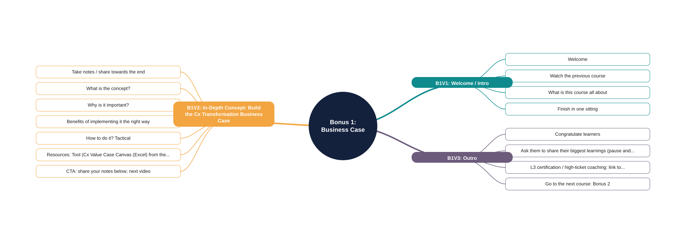
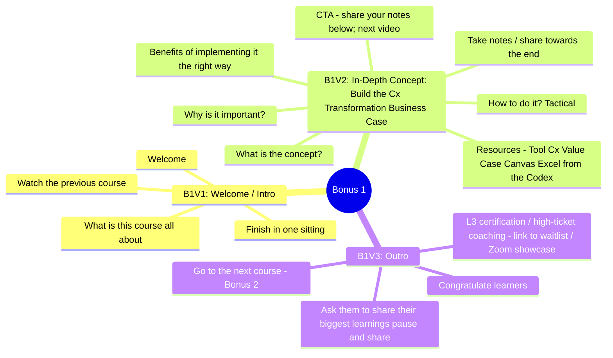

# Bonus 1 Mind Map

```mermaid
mindmap
  root((Bonus 1))
    B1V1: Welcome / Intro
      Welcome
      Watch the previous course
      What is this course all about
      Finish in one sitting
    B1V2: In-Depth Concept: Build the Cx Transformation Business Case
      Take notes / share towards the end
      What is the concept?
      Why is it important?
      Benefits of implementing it the right way
      How to do it? Tactical
      Resources - Tool Cx Value Case Canvas Excel from the Codex
      CTA - share your notes below; next video
    B1V3: Outro
      Congratulate learners
      Ask them to share their biggest learnings pause and share
      L3 certification / high-ticket coaching - link to waitlist / Zoom showcase
      Go to the next course - Bonus 2
```
