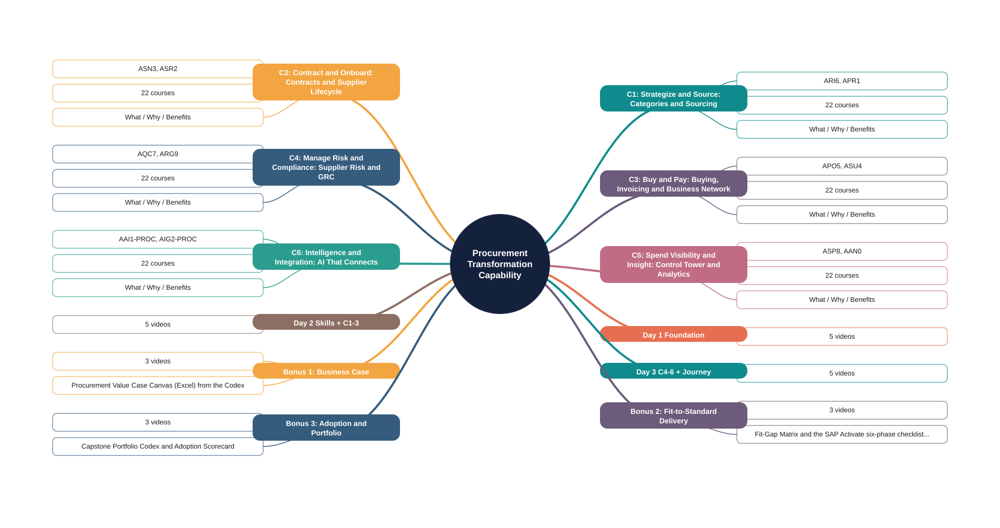
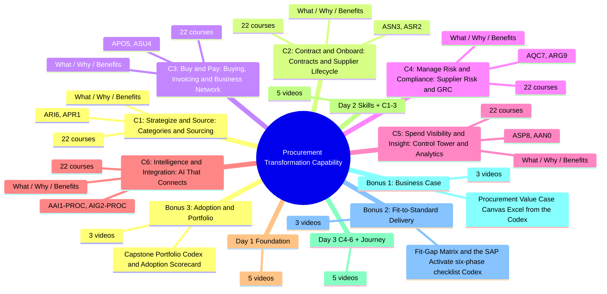

# Course Mind Map

```mermaid
mindmap
  root((Procurement Transformation Capability))
    C1: Strategize and Source: Categories and Sourcing
      ARI6, APR1
      22 courses
      What / Why / Benefits
    C2: Contract and Onboard: Contracts and Supplier Lifecycle
      ASN3, ASR2
      22 courses
      What / Why / Benefits
    C3: Buy and Pay: Buying, Invoicing and Business Network
      APO5, ASU4
      22 courses
      What / Why / Benefits
    C4: Manage Risk and Compliance: Supplier Risk and GRC
      AQC7, ARG9
      22 courses
      What / Why / Benefits
    C5: Spend Visibility and Insight: Control Tower and Analytics
      ASP8, AAN0
      22 courses
      What / Why / Benefits
    C6: Intelligence and Integration: AI That Connects
      AAI1-PROC, AIG2-PROC
      22 courses
      What / Why / Benefits
    Day 1 Foundation
      5 videos
    Day 2 Skills + C1-3
      5 videos
    Day 3 C4-6 + Journey
      5 videos
    Bonus 1: Business Case
      3 videos
      Procurement Value Case Canvas Excel from the Codex
    Bonus 2: Fit-to-Standard Delivery
      3 videos
      Fit-Gap Matrix and the SAP Activate six-phase checklist Codex
    Bonus 3: Adoption and Portfolio
      3 videos
      Capstone Portfolio Codex and Adoption Scorecard
```
