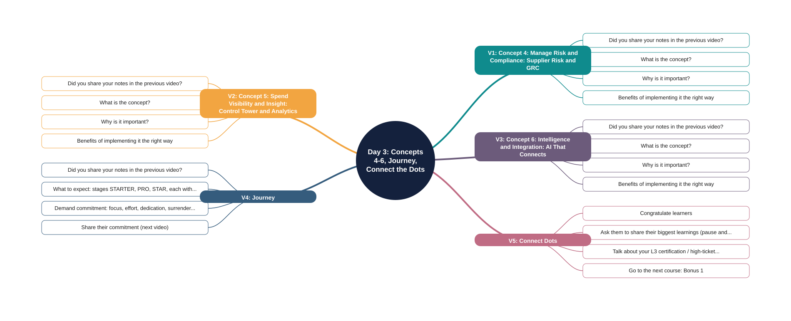
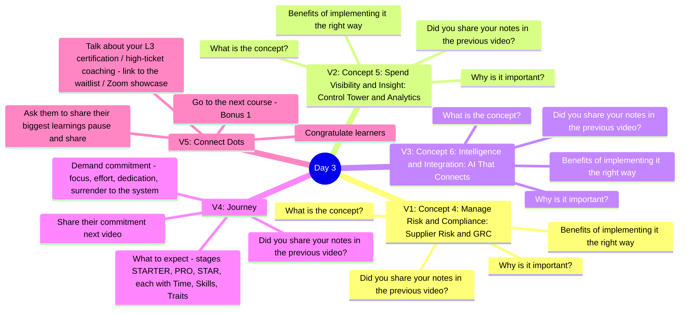

# Day 3 Mind Map

```mermaid
mindmap
  root((Day 3))
    V1: Concept 4: Manage Risk and Compliance: Supplier Risk and GRC
      Did you share your notes in the previous video?
      What is the concept?
      Why is it important?
      Benefits of implementing it the right way
    V2: Concept 5: Spend Visibility and Insight: Control Tower and Analytics
      Did you share your notes in the previous video?
      What is the concept?
      Why is it important?
      Benefits of implementing it the right way
    V3: Concept 6: Intelligence and Integration: AI That Connects
      Did you share your notes in the previous video?
      What is the concept?
      Why is it important?
      Benefits of implementing it the right way
    V4: Journey
      Did you share your notes in the previous video?
      What to expect - stages STARTER, PRO, STAR, each with Time, Skills, Traits
      Demand commitment - focus, effort, dedication, surrender to the system
      Share their commitment next video
    V5: Connect Dots
      Congratulate learners
      Ask them to share their biggest learnings pause and share
      Talk about your L3 certification / high-ticket coaching - link to the waitlist / Zoom showcase
      Go to the next course - Bonus 1
```
