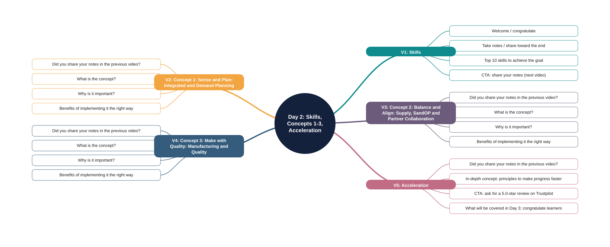
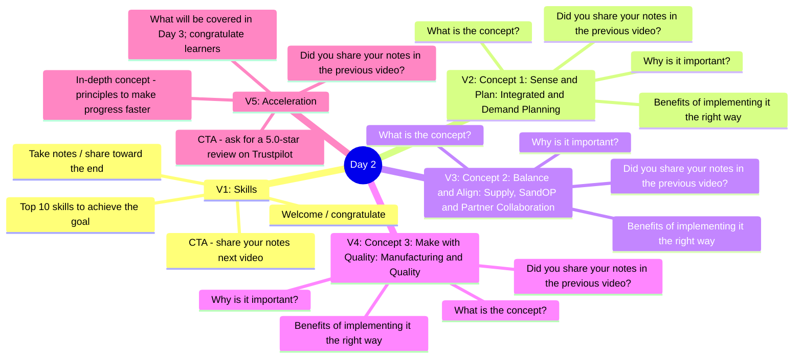

# Day 2 Mind Map

```mermaid
mindmap
  root((Day 2))
    V1: Skills
      Welcome / congratulate
      Take notes / share toward the end
      Top 10 skills to achieve the goal
      CTA - share your notes next video
    V2: Concept 1: Sense and Plan: Integrated and Demand Planning
      Did you share your notes in the previous video?
      What is the concept?
      Why is it important?
      Benefits of implementing it the right way
    V3: Concept 2: Balance and Align: Supply, SandOP and Partner Collaboration
      Did you share your notes in the previous video?
      What is the concept?
      Why is it important?
      Benefits of implementing it the right way
    V4: Concept 3: Make with Quality: Manufacturing and Quality
      Did you share your notes in the previous video?
      What is the concept?
      Why is it important?
      Benefits of implementing it the right way
    V5: Acceleration
      Did you share your notes in the previous video?
      In-depth concept - principles to make progress faster
      CTA - ask for a 5.0-star review on Trustpilot
      What will be covered in Day 3; congratulate learners
```
